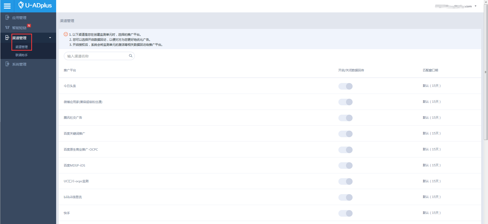
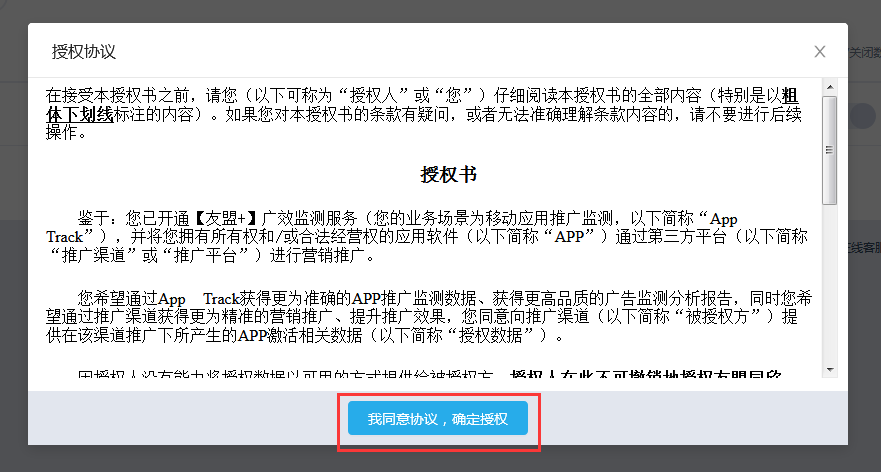

#### 1. 在“应用管理”中选择您需要监测的应用

#### 2. 选择“添加推广计划”

#### 3. 根据您的需求，填写推广计划的基本信息，然后点击“下一步”

#### 4. 在“推广渠道”字段，选择“ZPLAY Ads”，并根据需求填写其他字段

#### 5. 填写完成后，点击“确认”，保存您的设置

#### 6. 保存后，在该页面复制生成的点击监测链接和曝光检测代码

#### 7. 如果您随后还需要再次查看监测链接信息，可以在“应用管理”中选择您需要监测的应用后，在下方表格中点击您所创建的计划右侧的“监测”按钮，便可以查看该项推广计划的监测链接

#### 8. 点击“渠道管理”中的“渠道管理”

#### 9. 在输入框中输入ZLPAY Ads，并点击对ZLPAY Ads的“开启/关闭数据回传”按钮

#### 10. 点击“我同意协议，确定授权”以将数据授权给ZPLAY Ads。授权后，ZPLAY Ads才可以收到您应用的激活信息，才可以正确与您结算

#### 11. 在您创建广告或者编辑广告时将获取到的点击监测链接填写到ZPLAY Ads的监测地址框内，将获取到的曝光监测代码填写到ZPALY Ads的展示监测地址框内
