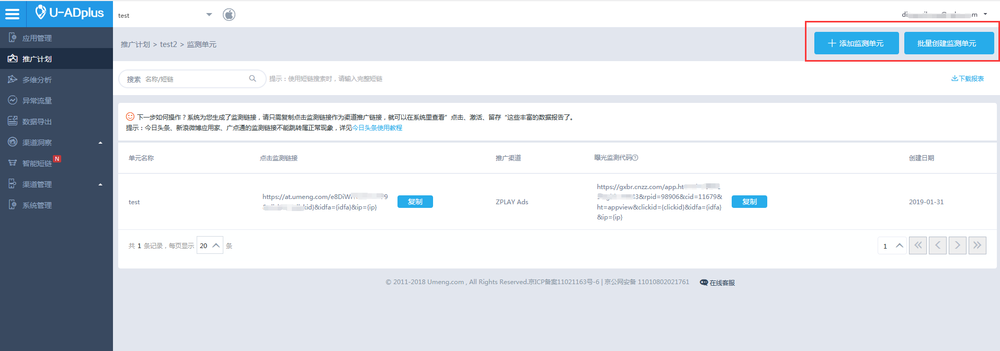
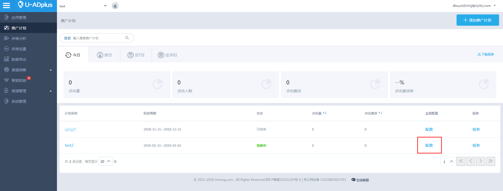

#### 1. 进入“应用管理”页面，在应用列表中找到您需要推广的应用后，点击应用名称进入应用下推广计划列表

#### 2. 若您想要创建新的推广计划，在此页面点击“添加推广计划”按钮，进入步骤2.1;
#### 若您想为已有的推广计划添加监测单元，点击此页面中计划名称，进入监测单元列表 进入步骤2.2

##### 2.1 根据您的需求，填写推广计划的基本信息，然后点击“下一步”

##### 2.2 在监测单元列表页面点击“添加监测单元”创建单个监测单元或点击“批量创建监测单元”创建多个监测单元

#### 3. 在“推广渠道”下拉列表中，选择“ZPLAY Ads”，信息填写完整后点击“确认”按钮保存您的设置

#### 4. 您在监测单元列表中找到创建的监测单元后，可直接在该页面复制生成的点击监测链接和曝光监测代码

#### 6. 进入“渠道管理”目录下的“渠道管理”页面，在渠道列表中找到ZLPAY Ads。您需要手动将“开启/关闭数据回传”按钮置为开启状态，在您手动设置这一选项之前，友盟不会将激活数据回传给ZPLAY Ads

**在您将“开启/关闭数据回传”按钮开启时，友盟会需要您同意“授权协议”，您点击“我同意协议，确定授权”后“开启/关闭数据回传”按钮才可打开**

#### 5. 如果您随后还需要再次查看监测链接信息，可以在“应用管理”中选择您需要监测的应用后，在下方表格中点击您所创建的计划右侧的“监测”按钮，便可以查看该项推广计划的监测链接

#### 6. 在您创建广告或者编辑广告时将获取到的点击监测链接填写到ZPLAY Ads的监测地址框内，将获取到的曝光监测代码填写到ZPALY Ads的展示监测地址框内
